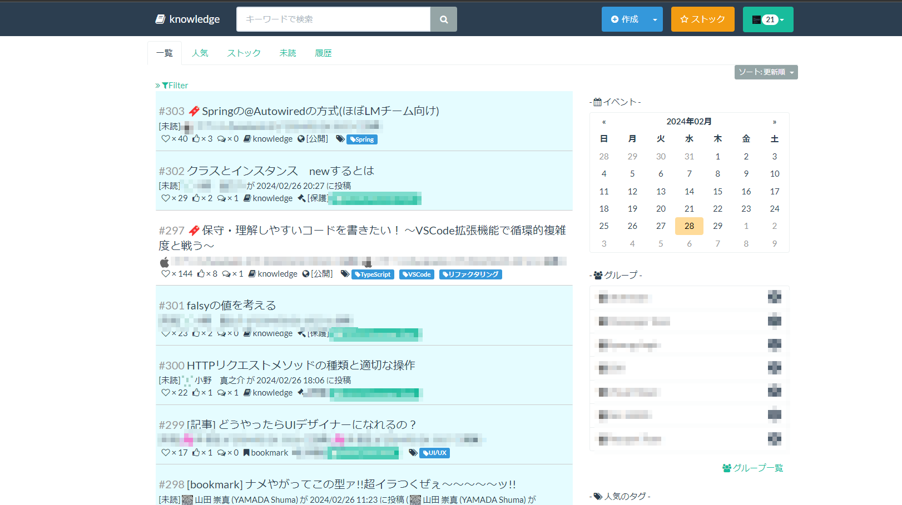

### 自己紹介

|            |                                    |
| ---------- | ---------------------------------- |
| 名前       | ebi-yu                             |
| 生年月日   | 1995 年 12 月 20 日                |
| 出身地     | 東京                               |
| 好きなこと | 新しい体験をすること、異国料理巡り |

### 経歴

| 年月日　　　 | 内容                                                                                                        |
| ------------ | ----------------------------------------------------------------------------------------------------------- |
| 2020 年 3 月 | 新潟大学大学院 医科学専攻 卒業                                                                              |
| 2020 年 4 月 | 株式会社ラキール 入社                                                                                       |
| 2020 年 8 月 | メッセージングアプリ( LaKeel Messenger ) チームにて iOS アプリ 開発に携わる                                 |
| 2021 年 3 月 | メッセージングアプリ( LaKeel Messenger ) チームにて iOS アプリ / バックエンド / フロントエンド 開発に携わる |
| 2021 年 6 月 | 新人研修にてボット開発研修を担当(主担当)                                                                    |
| 2022 年 4 月 | 認証基盤( LaKeel Passport ) チームにて LaKeel Passport の導入作業やアドオン開発に携わる                     |
| 2022 年 6 月 | 新人研修にてボット開発研修を担当(主担当)                                                                    |
| 2023 年 4 月 | フロントエンド開発基盤( LaKeel Visual Mosaic ) チームにてシステムのマイクロフロントエンド移行に携わる       |
| 2024 年 2 月 | マイクロアプリケーション( LaKeel Components ) チームにてチームリーダを担当                                  |

### その他活動

#### LaKeel Tech ブログ記事の執筆

[Vue2 と Vue3 を共存させるためのマイクロフロントエンドアプローチ (第二回) SystemJS による依存関係の動的解決～](https://tech-blog.lakeel.com/n/n3007d9dca4e7)

[社内にクライアント証明書認証を導入した話](https://tech-blog.lakeel.com/n/n91061e8093b1)

#### ナレッジサイトを社内に導入

### 技能一覧

| 分類           | 名前                                   | 期間   |
| -------------- | -------------------------------------- | ------ |
| モバイルアプリ | iOS アプリ開発(Obj-c, Swift)           | １年半 |
| バックエンド   | Nest.js API サーバ開発                 | 1 年   |
| バックエンド   | Java サーバ開発(Java11,Java13)         | 3 ヶ月 |
| フロントエンド | マイクロフロントエンド開発(Single-Spa) | 1 年   |
| フロントエンド | Vue3 コンポーネント開発                | 1 年   |
| フロントエンド | Nuxt.js サーバ開発                     | 3 ヶ月 |
