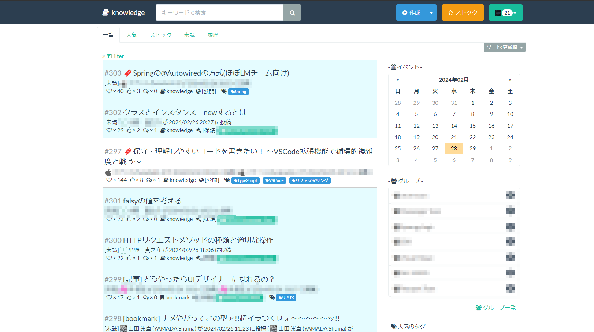

import styles from "../styles/markdown.css";

<h1 class="text-center">Ebi-yu Site</h1>

 
## Profile

|            |                                    |
| ---------- | ---------------------------------- |
| 名前       | ebi-yu                             |
| 生年月日   | 1995 年 12 月 20 日                |
| 出身地     | 東京                               |
| 好きなこと | 新しい体験をすること、異国料理巡り |

 
## Career

| 年月    | 内容                                                                                                        |
| ------- | ----------------------------------------------------------------------------------------------------------- |
| 2020/03 | 新潟大学大学院 医科学専攻 卒業                                                                              |
| 2020/04 | 株式会社ラキール 入社                                                                                       |
| 2020/08 | メッセージングアプリ( LaKeel Messenger ) チームにて iOS アプリ 開発に携わる                                 |
| 2021/03 | メッセージングアプリ( LaKeel Messenger ) チームにて iOS アプリ / バックエンド / フロントエンド 開発に携わる |
| 2021/06 | 新人研修にてボット開発研修を担当(主担当)                                                                    |
| 2022/04 | 認証基盤( LaKeel Passport ) チームにて LaKeel Passport の導入作業やアドオン開発に携わる                     |
| 2022/06 | 新人研修にてボット開発研修を担当(主担当)                                                                    |
| 2020/04 | フロントエンド開発基盤( LaKeel Visual Mosaic ) チームにてシステムのマイクロフロントエンド移行に携わる       |
| 2024/02 | マイクロアプリケーション( LaKeel Components ) チームにてチームリーダを担当                                  |

 
## Activities

 

##### **社外広報用 Tech ブログ記事の執筆**

- [Vue2 と Vue3 を共存させるためのマイクロフロントエンドアプローチ (第二回) SystemJS による依存関係の動的解決～](https://tech-blog.lakeel.com/n/n3007d9dca4e7)
- [社内にクライアント証明書認証を導入した話](https://tech-blog.lakeel.com/n/n91061e8093b1)

##### **ナレッジサイトを社内に導入**

- [OSS の knowledge を社内サーバに建てて運用](https://github.com/ebi-yu/knowledge)

  

 
## Skils

| 分類           | 名前                                     | 期間   |
| -------------- | ---------------------------------------- | ------ |
| モバイルアプリ | iOS アプリ開発(Obj-c, Swift)             | 1 年半 |
| バックエンド   | API サーバ開発(Nest.js, Typescript)      | 1 年   |
| バックエンド   | Java サーバ開発(Java11,Java13)           | 半年   |
| フロントエンド | マイクロフロントエンド開発(Single-Spa)   | 1 年   |
| フロントエンド | web コンポーネント開発(Vue3, Typescript) | 1 年   |
| フロントエンド | web クライアント開発(Nuxt.js)            | 半年   |

実務で 2 か月以上触ったことのある技術は[こちらを参照](https://stackshare.io/ebidevelopper1088/my-stack/main)
